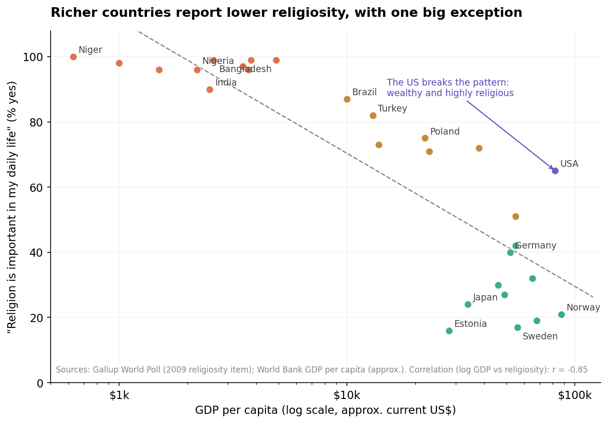
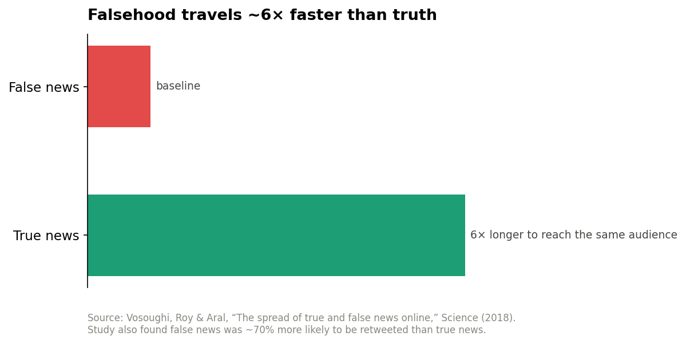

Title: Religion dichotomy
Date: 2024-07-05
Modified: 2024-07-05
Category: Personal

# Faith is personal. Enforcement is political.

*Why belief serves people best in private, and what happens to societies when it is weaponized at scale.*

---

I want to make a careful argument, because the lazy version of it is wrong and the careful version matters.

The lazy version says: religion makes countries poor. The careful version says: **faith held personally is one of humanity's oldest sources of meaning and resilience, but the moment belief becomes enforced, standardized, and coupled to power, it stops serving the believer and starts serving whoever controls the enforcement.** And in the age of WhatsApp forwards, that enforcement no longer needs an inquisition. It needs a share button.

Here is the case, with the data, including the parts of the data that do *not* support the lazy version.

## What the numbers actually show

Across roughly a hundred countries, survey data from the Gallup World Poll shows a strikingly consistent pattern: the wealthier a country, the smaller the share of people who say religion is important in their daily lives. Plotting religiosity against GDP per capita gives a correlation of about **r = -0.85** on the sample below, which is about as strong as cross-country social data ever gets.

Niger, Bangladesh, Ethiopia, Pakistan, Nigeria: near-universal religiosity, per-capita incomes under $3,000. Sweden, Denmark, Japan, Estonia: religiosity below 25%, incomes above $30,000. The gradient is smooth and global.

Now the honest part, because this is where most polemics cheat: **this correlation does not show that religion causes poverty.** The best-supported explanation in the research literature runs the other way. Norris and Inglehart's *existential security hypothesis*, built on decades of World Values Survey data, argues that **insecurity drives religiosity**. Where life is precarious, safety nets are weak, and institutions fail, people reach for the meaning, community, and coping that religion reliably provides. As material security rises, that demand falls. The United States, rich *and* religious, sits far off the trend line precisely because wealth alone does not secularize; security does, and America's thin safety net leaves more existential exposure than its GDP suggests.

So if the data does not say "religion causes poverty," what is the problem I am pointing at?

## The problem is not belief. It is the capture of belief.

Look again at the high-religiosity, low-income cluster. What those societies share is not just poverty. It is that **religious authority is disproportionately likely to be fused with political power**: blasphemy laws, morality policing, clerical veto over legislation, religious identity as a condition of full citizenship. And history shows what that fusion does, regardless of which religion is being fused:

- **Divine right of kings** made obedience to the crown a religious duty and rebellion a sin. The church legitimized the throne; the throne protected the church.
- **State Shinto** in Imperial Japan was deliberately *engineered*: emperor-worship was constructed and mandated to bind a population to militarist nationalism.
- **Iran's post-1979 system** made clerical authority constitutionally supreme, so that political dissent could be prosecuted as an offense against God.
- **Modern religious nationalism**, in its Hindu, Buddhist, Christian, and Islamist variants alike, mobilizes religious identity electorally and uses it to define who "really" belongs to the nation.

Notice the pattern across four continents and four different faiths: **the mechanism is identical even when the creed is not.** That is the tell. The corruption does not live in any particular religion. It lives in the *fusion* of religious authority with political power, because a ruler who speaks for God has moved obedience beyond the reach of argument.

## Why enforced belief degrades thinking

Personal faith and enforced religion train the mind in opposite directions.

Faith arrived at personally is examined at least once; you had to decide to hold it. Enforced belief is never examined, because examination itself is the punishable act. A system that punishes doubt does not just control what people believe. It **atrophies the machinery of doubting**. Remove the habit of asking "is this actually true?" in one domain of life, and the habit weakens in every domain. What is left is a population trained to accept claims based on the *authority of the source* rather than the *quality of the evidence*, which is precisely the vulnerability that propagandists, and now algorithms, exploit.

## The WhatsApp test

If you want to watch this vulnerability operate in real time, open a family WhatsApp group.

The forwarded miracle cure. The doctored image of a desecrated shrine. The "scientists confirm" message stitching scripture to pseudoscience. Shared in seconds, by millions, with zero fact-checking, and shared *most confidently* by people trained since childhood to treat authority-shaped claims as beyond question.

The scale of this is measurable:

The landmark MIT study of roughly 126,000 news cascades on Twitter (Vosoughi, Roy and Aral, *Science*, 2018) found that **false news was about 70% more likely to be retweeted than true news, and true stories took roughly six times longer to reach 1,500 people.** Falsehood does not merely keep up with truth. It structurally outruns it, because it is engineered for emotion, and emotion is what gets shared.

Now combine the two curves. Take a population where enforced belief has already normalized accepting claims on authority. Add a distribution channel where falsehood travels six times faster than truth, wrapped in religious framing that makes fact-checking feel like blasphemy. India offers the grim case study: waves of WhatsApp-borne rumors, many with communal and religious framing, have been linked to real-world mob violence, forcing WhatsApp to limit forwarding globally after 2018. When a forward arrives dressed as devotion, questioning it is not skepticism anymore. It is sin. That is enforcement, running at internet scale, with no cleric required.

**Enforced religion and viral misinformation are the same exploit at different speeds**: both bypass individual reasoning by making acceptance a marker of loyalty and doubt a marker of betrayal.

## The strongest objection, taken seriously

An honest version of this argument has to state what the data does *not* say, and what the other side would say. Three things:

**Organized religion has also been history's great resistance machine.** The Black church was the backbone of the American civil rights movement. The Catholic Church anchored Polish resistance to communism. Abolitionism was overwhelmingly a religious movement. The same institutional machinery that can sanctify power can defy it. Organized religion is a *power amplifier*, and it amplifies whoever captures it. Which is exactly why the institutional arrangement, established church versus separated church, predicts outcomes better than the mere presence of religion does.

**The 20th century's most brutal thought-control systems were explicitly anti-religious.** Stalinism, Maoism, the Khmer Rouge. The root variable is *unaccountable power seeking a legitimating ideology*. Religion is one candidate ideology among several, not the disease itself.

**Poverty in high-religiosity countries is overwhelmingly explained by other factors**: colonial extraction, weak institutions, conflict, geography, commodity dependence. The development literature (Acemoglu and Robinson on institutions, Sachs on geography) does the heavy lifting here; religiosity mostly rides along as a symptom of the insecurity these produce.

None of this weakens the thesis. It sharpens it: **the danger was never faith, and it was never even organized faith. It is enforced faith, belief welded to power, where doubt is punished and loyalty is measured in shares and forwards.**

## Where this leaves us

Keep the faith; refuse the enforcement. Concretely:

Separation of religious authority from state power protects both directions at once. It protects citizens from clericalism, and it protects faith from becoming a government department. The countries where religion remains vibrant *and* society remains free are almost uniformly the ones that keep the two apart.

And at the personal level, the test is simple and portable: **any belief system, religious, political, or algorithmic, that punishes the question "is this actually true?" is not asking for your faith. It is asking for your obedience.** The forward you do not fact-check because checking feels disloyal is a small act of that obedience. The habit of checking anyway is the whole immune system.

Faith is what you choose in private. Enforcement is what someone else chooses for you. The first has consoled humans for ten thousand years. The second has controlled them for just as long, and it has never moved faster than it does today.

---

*Sources: Gallup World Poll religiosity data; World Bank GDP per capita; Norris and Inglehart, "Sacred and Secular" (existential security hypothesis); Vosoughi, Roy and Aral, "The spread of true and false news online," Science (2018); reporting on WhatsApp forward limits and rumor-linked violence in India (2018). GDP and survey figures are approximate. Verify current figures before publication.*
 