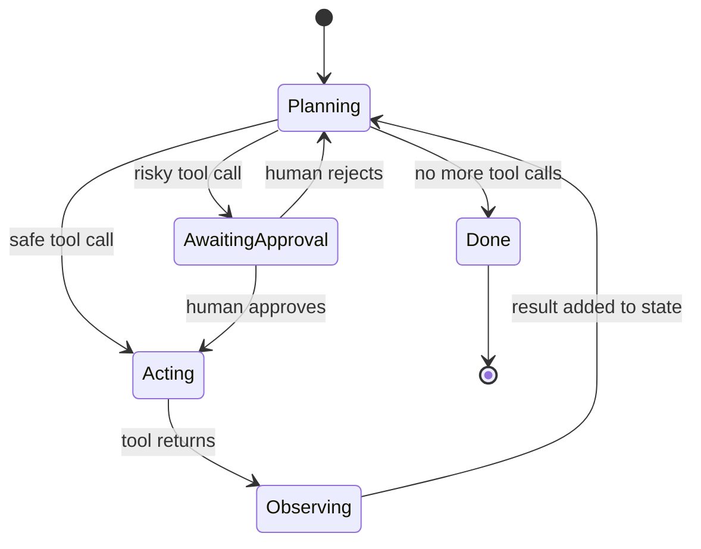
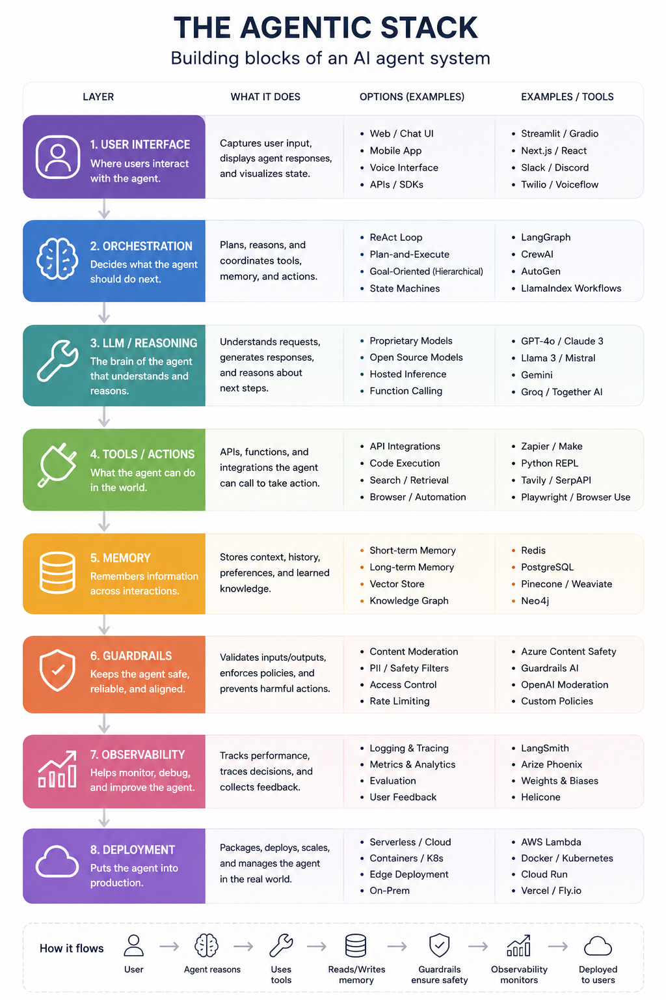

Title: Combobulating the Agentic Stack
Date: 2026-01-11
Category: Tech

# Combobulating the Agentic Stack

*A working map of the six layers every production agent stands on, and where the interesting boundaries are.*

If you have watched Claude's loading spinner, you have seen words like "combobulating" and "mulling" flash by while the model thinks. That is a fitting mood for the agent infrastructure market right now: dozens of tools, overlapping claims, and a lot of thinking out loud. This post is my attempt to combobulate it into a stack you can actually reason about.

I look at every agent tool through six layers. A request flows bottom-up: a model produces a decision, protocols carry it to tools, state persists what happened, a runtime decides what happens next, evals tell you whether any of it worked, and an application is what the user finally sees.

```
6. Applications             Claude Code · Cursor · support & data agents
5. Eval                     Harbor · LangSmith · Braintrust · Arize
4. Frameworks & runtimes    LangGraph · Claude Agent SDK · Temporal
3. Memory & state           Postgres/pgvector · Redis · Mem0 · Zep
2. Protocols & tools        MCP · Composio · Daytona · E2B · MCP-UI
1. Models & inference       Claude · GPT · Llama · vLLM · Modal
```

My bias, stated up front: I run infrastructure and security teams for a living. The layers that decide whether your agent survives contact with production are 2, 3, and 5. That is where this post spends its time.

## Layer 1: Models and inference

Two decisions hide in this layer, and teams routinely conflate them. Which model: Claude, GPT, Gemini, or an open-weight family like Llama or Qwen. And where inference runs: a managed API, an enterprise gateway like Bedrock or Vertex, or self-served open models on vLLM via platforms like Modal, Together, or Fireworks.

The practical pattern is routing, not loyalty. A support agent classifies intent with a small cheap model served on vLLM and escalates reasoning-heavy turns to a frontier model. Done well, this cuts inference cost 5 to 10x without a measurable quality drop, because most turns in most agents are not hard.

## Layer 2: Protocols and tools

This is how an agent touches anything beyond text, and it splits into four distinct sub-layers that get lumped together far too often.

**Agent protocols.** MCP and native function calling are the wire formats; A2A is the emerging agent-to-agent equivalent. MCP won the connectivity argument fast because it turned N x M integrations into N + M.

**Tool platforms.** Composio, Arcade, and Zapier's MCP surface sell managed catalogs of hundreds of pre-authenticated tools. What you are actually buying is OAuth token management and permission scoping, which is drudgery you do not want to own.

**Sandboxes and code execution.** When an agent writes code, that code is untrusted by definition. It might be hallucinated, buggy, or the product of a prompt injection. Daytona, E2B, and Modal Sandboxes give each execution an isolated environment with its own filesystem and kernel-level boundary, spun up in well under a second. If your agent runs its own generated code on a shared production host, you do not have an agent, you have an incident in staging.

**Interactive UI over MCP.** The newest sub-layer, and the answer to "where does MCP-UI fit?" Plain MCP defines how an agent calls a tool. MCP-UI extends the same protocol so a tool's response can be an interactive UI resource, an iframe or web component the host app renders inline, with user events flowing back to the agent. A booking server returns a seat map instead of a JSON blob. OpenAI's Apps SDK is the same idea in that ecosystem; AG-UI standardizes the framework-to-frontend event stream. The one-liner: MCP made tools legible to agents, and MCP-UI makes tool results legible to humans again. It technically lives in layer 2, but it is the one sub-layer whose output belongs to layer 6.

## Layer 3: Memory and state

Everything the agent knows beyond its current context window. Postgres, often with pgvector, is the durable backbone: checkpoints, run history, transactional state. Redis holds hot session state. Vector stores like Pinecone handle semantic recall. Managed memory layers like Mem0 and Zep take over extraction, consolidation, and decay so you are not hand-rolling a forgetting policy.

The unglamorous insight from running stateful systems: your agent's state store deserves the same rigor as any OLTP schema. A LangGraph checkpointer writing every step to Postgres means a workflow interrupted for human approval resumes exactly where it paused, days later, on a different pod. That is not a framework feature. That is a database doing what databases do.

## Layer 4: Frameworks and runtimes

The orchestration brain: control flow, retries, branching, and human-in-the-loop gates. LangGraph gives you explicit state machines. The Claude Agent SDK and OpenAI Agents SDK give you lighter loops that lean on the model's own judgment. CrewAI packages multi-agent patterns. Temporal sits underneath any of them when you need durable execution with industrial guarantees.

The design decision that matters most here is the interrupt. Any agent that mutates real systems needs a point where it stops, shows a human what it intends to do, and waits. In LangGraph this is an interrupt node; in a hand-rolled loop it is ten lines of code. Either way, it is the difference between an agent you can deploy and a demo you can film.

It is worth being precise about what these runtimes actually are: state machines, not flowcharts. A flowchart describes an algorithm, steps executed once, top to bottom. A state machine describes a system: a finite set of states it can rest in, with transitions fired by events. That distinction buys you three things agents need. The machine can idle ("awaiting approval" is a legitimate place to park for three days). It can re-enter states (the loop revisits planning dozens of times per task). And the current state is data, which means it can be checkpointed to Postgres and resumed on a different pod. Durability is a property of the state machine framing, not of any particular framework.



## Layer 5: Eval

How you know any of this works. Three sub-categories, split by when they run.

**Benchmarks and harnesses** run before release. Harbor, from the Terminal-Bench team, is the emerging standard here: it specifies containerized tasks with verifiable rewards and runs thousands of trials in parallel across sandbox providers. SWE-Bench covers the coding-agent slice.

**Tracing and observability** runs in production. LangSmith and Langfuse capture every trajectory; OpenTelemetry folds agent traces into the observability stack you already operate, which matters more than it sounds, because your on-call engineer should not need a second pane of glass at 3am.

**Eval and experiment platforms** sit across both. Braintrust and Arize AI (with its open-source sibling Phoenix) turn raw traces into scored experiments, LLM-as-judge pipelines, and regression gates. Braintrust leans toward experiment workflow and CI-style gating; Arize leans toward production monitoring and drift. They are complementary more than competing.

The wiring that makes this layer real: every production trajectory streams to your tracing tool, and a nightly Harbor job replays a golden task suite against any prompt or model change, blocking the release if reward drops. Evals in CI, not evals in a spreadsheet.

## Layer 6: Applications

Where value lands: coding agents like Claude Code and Cursor, support agents, data and config agents, domain copilots. The only layer users see, and the only layer they care about. Every layer below exists so this one can be boring and reliable.

## Another cut of the same stack

Taxonomies of this space are proliferating, and a popular one draws the stack as eight layers instead of six:



The two views map onto each other almost completely. User Interface is my Applications layer. Orchestration is Frameworks and runtimes. LLM/Reasoning is Models and inference. Tools/Actions is Protocols and tools. Memory is Memory and state. Observability is one third of my Eval layer. The eight-layer view then promotes two things to layers that I deliberately keep as properties: Guardrails and Deployment.

That difference is worth dwelling on, because it is a real disagreement about architecture, not just labeling. Treating guardrails as a layer suggests you can buy a box, wire it inline, and be safe. In practice the controls that matter live inside other layers: sandbox isolation and access control in layer 2, interrupt gates in layer 4, regression evals and tracing in layer 5, and RBAC on the state store in layer 3. A moderation endpoint bolted between the user and the model catches slurs; it does not catch an agent exfiltrating data through a tool call it was authorized to make. Guardrails are a property the whole stack either has or does not have. The same goes for Deployment: Kubernetes, serverless, and edge are the substrate everything runs on, not a layer agents flow through.

Where the eight-layer view earns its keep is as a checklist. If you are assembling your first agent, "have I thought about each of these eight boxes" is a genuinely useful audit, and its Options column doubles as a shopping list. The six-layer view is the dependency graph you architect against; the eight-layer view is the inventory you check before shipping. Keep both in your pocket.

## The whole stack in 100 lines

Abstractions are easier to trust once you have built the unabstracted version. Here is a form-filling agent that is the entire stack in miniature: Claude is layer 1, four hand-rolled Playwright tools are layer 2, the message list is layer 3 state, a while loop is the layer 4 runtime, and a human approval gate guards the click.

```python
TOOLS = [
    {"name": "navigate", "description": "Open a URL.", ...},
    {"name": "read_page", "description": "Return form fields and text.", ...},
    {"name": "fill", "description": "Fill an input by CSS selector.", ...},
    {"name": "click", "description": "Click. A human approves every click.", ...},
]

async def run_tool(page, name, args):
    ...
    if name == "click":
        answer = input(f"Agent wants to click '{args['selector']}'. Approve? [y/N] ")
        if answer.strip().lower() != "y":
            return {"ok": False, "error": "human rejected the click"}
        await page.click(args["selector"])
        return {"ok": True, "url": page.url}

messages = [{"role": "user", "content": task}]
while True:
    resp = client.messages.create(model=MODEL, tools=TOOLS, messages=messages)
    messages.append({"role": "assistant", "content": resp.content})
    if resp.stop_reason != "tool_use":
        break
    messages.append({"role": "user", "content": run_all_tools(resp)})
```

Two details carry the lesson. `read_page` returns a structured inventory of form fields instead of raw HTML, because cheap deterministic context beats dumping the DOM into the prompt. And `click` cannot fire without approval, which is the same interrupt pattern LangGraph formalizes, at the smallest possible scale. (Full runnable version in the repo. Automate only forms you own or are authorized to touch, keep credentials out of prompts, and treat a CAPTCHA as a site telling you no.)

## Where this is heading

The stack is consolidating from both ends. Model providers are eating downward into layer 2, shipping their own sandboxes, tool catalogs, and UI protocols. Framework vendors are eating upward into layer 5, bundling evals and tracing. The boundaries most likely to survive are the ones backed by real operational gravity: isolation (sandboxes), state correctness (your database), and audit (evals plus tracing). Not coincidentally, those are the layers where infrastructure and security discipline separates the demos from the systems.

Pick one tool per layer, wire the seams, and ship something small. The stack rewards teams that treat it like infrastructure, because that is what it is.
